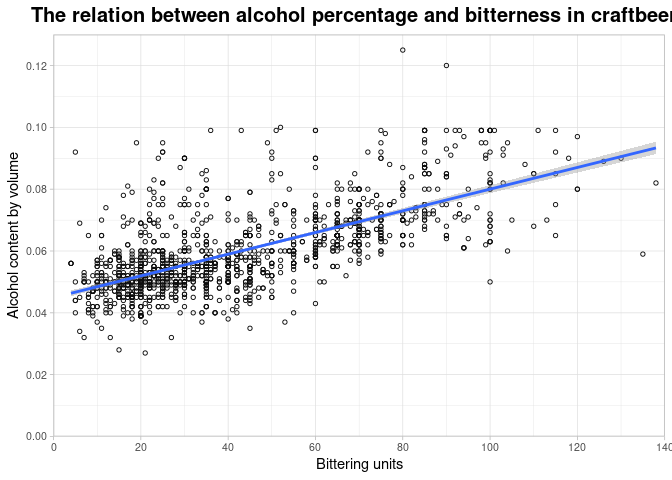

Beer analysis script
====================

For the beer analysis script, the ‘../dataset/beers.csv’ dataset was
used to create a plot between alcohol percentage and bitterness.

The plot was made using ggplot2.

    ## `geom_smooth()` using formula 'y ~ x'

    ## Warning: Removed 1005 rows containing non-finite values (stat_smooth).

    ## Warning: Removed 1005 rows containing missing values (geom_point).

The plot shows that there is a linear trend between alcohol percentage
and bitteress.
