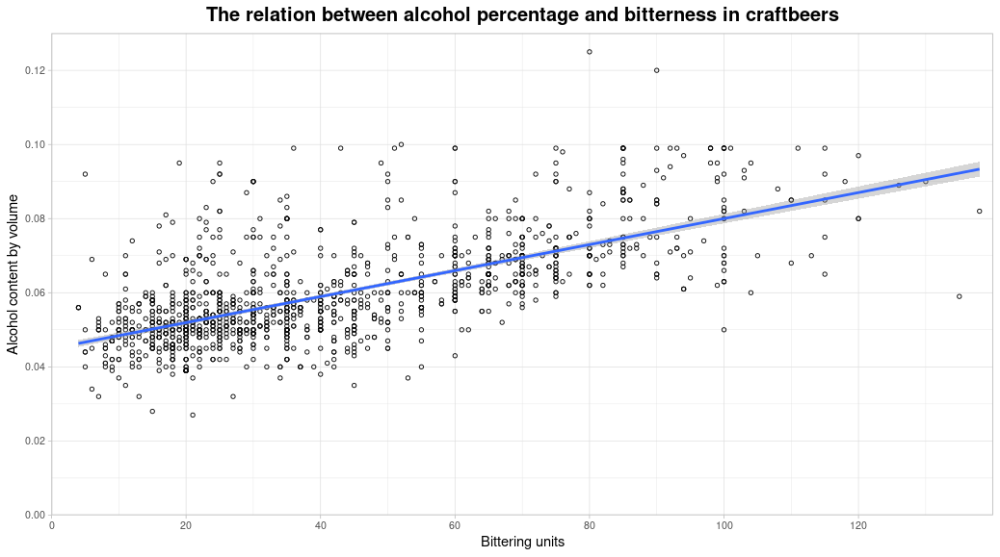

# Craft beer analysis
> Authors: Martijn Melissen, Angela Pelissou Ayuso, and Luuk Perdaems

A lot of craft beer stores have been popping up lately, which gives us the opportunity to do some interesting analyses! For this analysis, we compared alcohol percentage with bitterness.

## The dataset
An open-source [dataset](https://www.kaggle.com/nickhould/craft-cans) was used for this project, which contains information of more than 2000 craftbeers and over 500 breweries. The dataset can be found in the dataset folder.

The [beer dataset](dataset/beers.csv) in the dataset folder contains information per beer:
- abv - The alcoholic content by volume (between 0 and 1)
- ibu - The amount of [bittering units](https://www.thespruceeats.com/international-bittering-units-353254)
- id - The unique beer ID
- name - The name of the beer
- style - The beer style (lager, ale, IPA, etc.)
- brewery\_id - The ID of the brewery [breweries dataset](dataset/breweries.csv)
- ounces - The size of beer in
ounces

The [breweries dataset](dataset/breweries.csv) in the dataset folder contains information about the different breweries:
- brewery\_id - The ID of the brewery [beers dataset](dataset/beers.csv)
- name - Name of the brewery
- city - The city that the brewery is located in
- state - The state that the brewery is located in

## The analysis
A [R script](R/beer_analysis.R) was used to generate a scatterplot between craftbeer alcohol percentage and bitterness. The data for this plot was obtained from the [beer dataset](dataset/beers.csv).

_Each dot in the graph represents a beer. Beers without an unknown bitterness unit were removed. The trendline shows the average alcohol percentage per bitterness units,_
